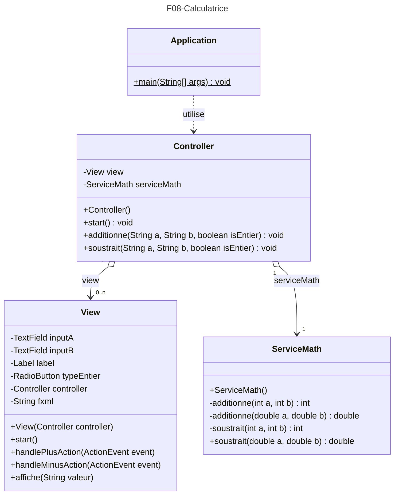

# Devoir 08 : La calculatrice
Exercice sur l'utilisation des Wrappers
## CONSIGNE :
- Regardez avec attention les schémas UML et la javadoc fournis ci-dessous.
- Compléter les deux méthodes `additionne()` et `soustrait()` de la classe `Controller`

Vous devriez pouvoir utiliser l'application de calculatrice ci-dessous :

# UML :
## Diagramme des classes de l'application

## Javadoc
Vous pouvez cliquer sur [ce lien pour obtenir la JavaDoc en HTML](javadoc/index.html) de l'application **Calculatrice**.

## RESTITUTION :
1. Rendre ce devoir normalement par `push` GitHub
